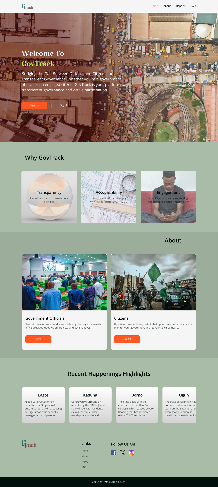
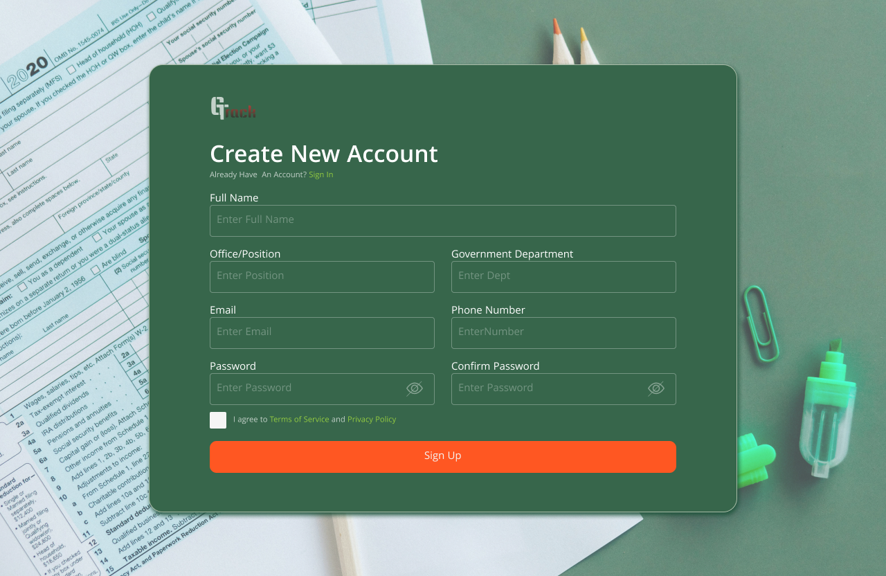
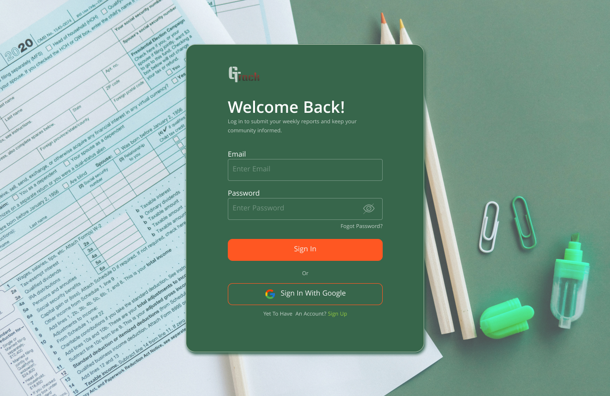
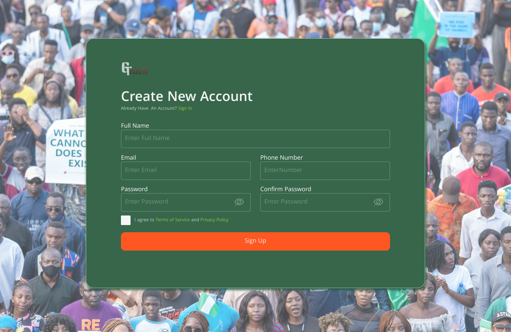
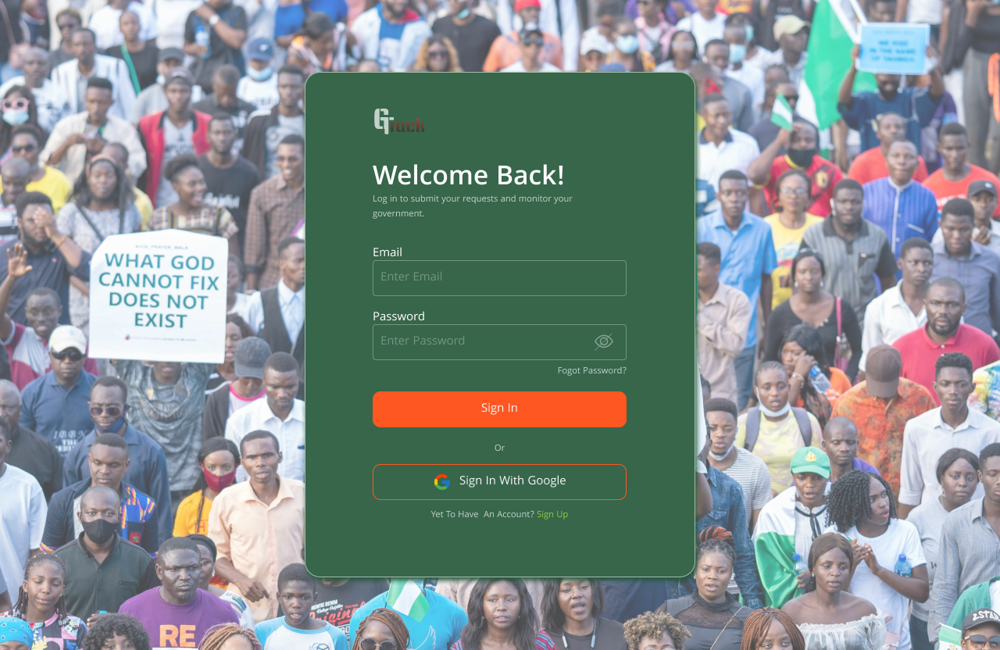

# GovTrack WebApp  
### Project By: Adebayo Oluwaseun Ayomide
### [Figma Link](https://www.figma.com/design/6GBtIKZOUArI968Dv1x67o/HACKTOBERFEST?node-id=551-232&t=Smez17iZVVcMfuLY-1)  

GovTrack is a web application designed to enhance transparency and accountability in governance. It allows government officials to submit weekly reports on office activities and projects, while citizens can track these reports and submit infrastructure requests. Citizens can also upvote or downvote requests, helping prioritize issues that matter most to their communities.  

## Features  

### Government Officials:
- Sign-up/Login to submit weekly reports.
- Monitor citizen requests and address feedback.  

 

### Citizens:
- Sign-up/Login to view reports on government activities.
- Submit infrastructure requests and vote on requests submitted by others.
- Track the progress of government projects and community needs. 

  

 

### Transparency and Accountability:
- Real-time updates on government initiatives and citizen feedback.
- Public access to weekly reports and status of citizen requests.

